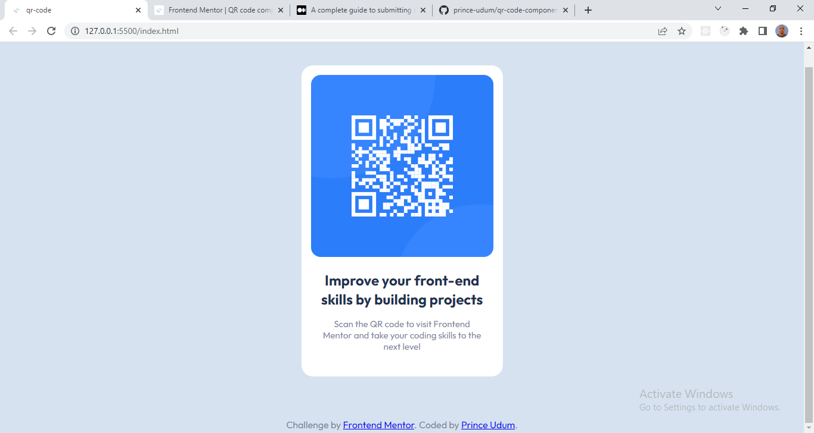

# Frontend Mentor - QR code component solution

This is a solution to the [QR code component challenge on Frontend Mentor](https://www.frontendmentor.io/challenges/qr-code-component-iux_sIO_H). Frontend Mentor challenges help you improve your coding skills by building realistic projects. 

## Table of contents

- [Overview](#overview)
  - [Screenshot](#screenshot)
  - [Links](#links)
- [My process](#my-process)
  - [Built with](#built-with)
  - [What I learned](#what-i-learned)
- [Author](#author)


## Overview

### Screenshot



### Links

- Solution URL: [Add solution URL here](https://github.com/prince-udum/qr-code-component)
- Live Site URL: [Add live site URL here](https://your-live-site-url.com)

## My process

### Built with

- Semantic HTML5 markup
- CSS custom properties
- Flexbox
- Mobile-first workflow

### What I learned

This project help me to recap over some of my major learnings on css flexbox.

```html
<main>...</main>
```
```css
main {
    min-height: 100vh;
    display: flex;
    justify-content: center;
    align-items: center;
}
```


## Author

- Frontend Mentor - [@prince-udum](https://www.frontendmentor.io/profile/prince-udum)
- Twitter - [@yourusername](https://twitter.com/princeudum)


